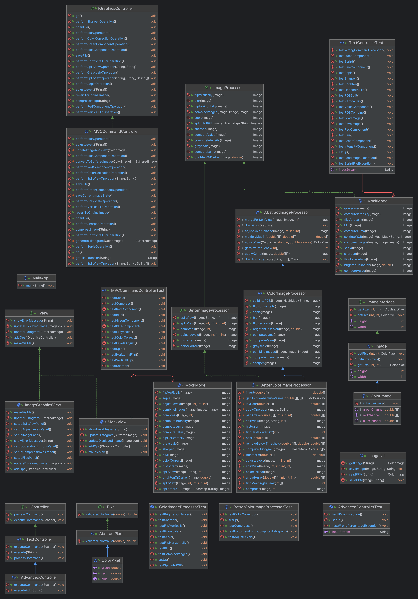

# Image Manipulation and Enhancement
## Assignment 4
### Prabesh Paudel and Ritika Dhall

## 1. Overview
This Java application is designed using the Model-View-Controller (MVC) pattern to process images based on text commands provided by the user. The main components of the application include classes and interfaces related to image processing and command handling.

## 2. Features

- **RGB Splitting**: Decompose a color image into its individual Red, Green, and Blue channels.
- **Image Flipping**: Horizontally or vertically flip a given image.
- **Grayscale Conversion**: Convert a color image to grayscale using value, luma or intensity.
- **Brightness Adjustment**: Brighten or darken an image based on a provided factor.
- **Image Combination**: Combine three grayscale images into a single color image, using each as an RGB channel.
- **Blurring**: Apply a blur effect to an image using a convolutional kernel.
- **Sharpening**: Enhance the detail of an image by emphasizing edges.
- **Sepia Toning**: Apply a sepia tone to the image for a vintage effect.
- **Compression**: Reduce the size of an image with minimal loss of quality.
- **Histogram Generation**: Create a histogram that represents the distribution of colors in an image.
- **Color Correction**: Adjust the color balance of an image to enhance its overall appearance.
- **Levels Adjustment**: Modify the black, mid, and white levels of an image for better contrast and brightness.
- **Split preview**: View operations in a preview mode in a specified percentage of the image.

## 3. Design

### 3.1 Model

#### 3.1.1. Pixel Interface
- This is the most fundamental unit in the design, defining basic properties and methods any pixel should have. It ensures consistency and a basic contract for pixel-related operations.

#### 3.1.2. AbstractPixel
- An abstract class implementing the Pixel interface. It provides some default behavior or properties for pixels but isn't intended to be instantiated directly. Acts as a base for other specific pixel classes.

#### 3.1.3. ImageInterface
- Defines core functionalities any image class should provide. Sets the contract for operations like getting pixel data, setting pixel data, image dimensions, etc.

#### 3.1.4. Image Abstract Class
- Provides a concrete implementation of some methods declared in the `ImageInterface`. Acts as a foundation for specific image classes, ensuring code reuse and a consistent structure.

#### 3.1.5. ColorImage
- Extends the `Image` abstract class, specializing in handling colored images. Provides methods and properties specific to colored images, like operations on RGB channels.

#### 3.1.6. ImageProcessor Interface
- Sets the contract for processing operations on images. Declares methods any image processor should implement.

#### 3.1.7. AbstractImageProcessor
- Provides a foundation for specific image processors. Might have default implementations for common image processing methods or utilities.

#### 3.1.8. ColorImageProcessor
- Extends the `AbstractImageProcessor`, specializing in processing colored images. Uses functionalities provided by the `ColorImage` class and provides methods for operations like filtering, transformations, color adjustments, etc.

#### 3.1.9. BetterColorImageProcessor
- Extends `ColorImageProcessor`, adding advanced image processing capabilities such as histogram generation, color correction, and levels adjustment.

#### 3.1.10. BetterImageProcessor Interface
- An interface extending `ImageProcessor`, defining additional methods for advanced image processing tasks like compression and histogram analysis.

### 3.2 Controller

#### 3.2.1. IController Interface
- Sets the contract for all controllers, ensuring a certain structure and functionalities.

#### 3.2.2. ImageUtil
- A utility class containing static methods assisting in various image operations.

#### 3.3.3. TextController
- Interacts with the user through the command line, parsing user input and invoking appropriate methods on the `ColorImageProcessor` to process the image. Acts as a bridge between user interface and processing logic.

#### 3.3.3. AdvancedController
- Interacts with the user through the command line. It adds more functionalities to the `TextConttroller`.

#### 3.3.3. MVCCommandController
- Interacts with the user through a graphical user interface. Takes in input through the GUI with the view class `ImageGraphicsView` and passes them onto the model to process.

### 3.3 View

#### 3.3.1. IView Interface
- Defines functionalities any view class should provide. Sets the contract for operations like add listeners, make display visible, etc.

#### 3.3.2. ImageGraphicsView
- A class that builds the display of the graphic user interface for the Image Manipulation application. Provides inputs for operations, displays images and histogram for the image.
It uses callback command design pattern to handle all the commands gracefully, all the new and old commands along with different exceptions have been properly handled.

### 3.4 MainApp
- Entry point of the application. Initializes and orchestrates the application components.

## 4. Analysis

### **S - Single Responsibility Principle (SRP):**
- Each class has a clear and distinct responsibility. For example, `Pixel Interface` deals only with pixel-related properties and methods, and `TextController` handles user interactions.

### **O - Open/Closed Principle (OCP):**
- The system is designed to be extendable without modifying existing code. Abstract classes like `AbstractPixel` and `AbstractImageProcessor` can be extended to create new functionalities without altering their existing behavior.

### **L - Liskov Substitution Principle (LSP):**
- Derived classes can be used interchangeably with their base classes. For instance, `ColorImage` can be used wherever the `Image` abstract class is expected, ensuring consistent behavior.

### **I - Interface Segregation Principle (ISP):**
- The system uses multiple specific interfaces like `Pixel Interface`, `ImageInterface`, and `ImageProcessor Interface`, ensuring that implementing classes don't need to be burdened with methods they don't use.

### **D - Dependency Inversion Principle (DIP):**
- Higher-level modules like `TextController` are not directly dependent on low-level modules but depend on abstractions. This is evident as `TextController` interacts with the `ColorImageProcessor` through interfaces and abstract classes.

## 5. Running the application

- Open the project directory and change directories to the res directory by this command into the terminal using `cd res`.

### **Running the graphical user interface**
- Use this command to run the graphical user interface `java -jar Image-Manipulation-and-Enhancement.jar`

### **Running the interactive command line interface**
- Use this command to run the interactive command line user interface `java -jar Image-Manipulation-and-Enhancement.jar -text`

### **Running a script file**
- Use this command to run a basic script file `java -jar Image-Manipulation-and-Enhancement.jar -file basic_script.txt`
- Use this command to run a lengthier script file `java -jar Image-Manipulation-and-Enhancement.jar -file script.txt`

---
**Image Credit**: 

Hennessy, R. (n.d.). Brown fox on snow field [Photograph]. Unsplash. https://unsplash.com/photos/brown-fox-on-snow-field-xUUZcpQlqpM. Accessed November 1, 2023.

**Image Credit**: Licht, J. (n.d.). Body of water near cityscape at daytime [Photograph]. Unsplash. [https://unsplash.com/photos/8nA_iHrxHIo](https://unsplash.com/photos/8nA_iHrxHIo). Accessed November 17, 2023.

### Errata
Changes since Assignment 4: 
1. The pixel data can no longer be manipulated from the controller. The getters for Pixel has been removed. This was a problematic design in the previous version because clients were able to make changes to the pixel data which is undesirable. 
2. Change the implementation of sepia function. Manual computation was being done in the previous version, but now it has been changed to a matrix multiplication which is much more efficient. 
3. Helper functions in ColorImageProcessor has been moved to AbstractImageProcessor as protected method to reduce duplication. 