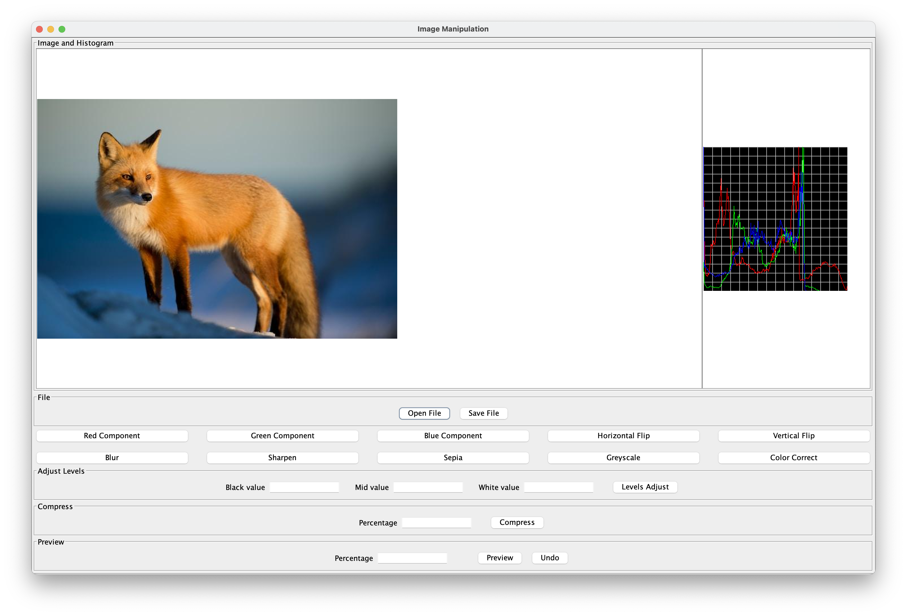

## Overview of the Graphpical User Interface

1. **Image view**: Displays a selected image. Any operation on the image will be updated here. If a
bigger picture is provided, it will become a scrollable windodw.
2. **Histogram view**: Displays th histogram of the current image displayed in Image view. It gets
updated with the current image.
3. **Open File button**: Opens a browser to select a file to operate on.
4. **Save File button**: Save the current file displayed in the application.
5. **Red Component button**: Performs an operation on the current image to view the red component.
6. **Green Component button**: Performs an operation on the current image to view the green component.
7. **Blue Component button**: Performs an operation on the current image to view the blue component.
8. **Horizontal Flip Component button**: Flip the displayed image horizontally.
9. **Vertical Flip Component button**: Flip the displayed image vertically.
10. **Blur button**: Blur the displayed image.
11. **Sharpen button**: Sharpen the displayed image.
12. **Sepia button**: Apply a sepia filter on the displayed image.
13. **Greyscale button**: Apply a greyscale filter on the displayed image.
14. **Color Correct button**: Color correct the displayed image.
15. **Black value textfield**: Enter the black value for levels adjust operation.
16. **Mid value textfield**: Enter the mid value for levels adjust operation.
17. **White value textfield**: Enter the white value for levels adjust operation.
18. **Levels Adjust button**: Adjust the levels of the displayed image using the entered black, mid
and white values.
19. **Percentage textfield**: Enter the percentage to compress the image by.
20. **Compress button**: Compress the image by the entered percentage.
21. **Percentage textfield**: Enter the percentage to which the image should preview an operation.
22. **Preview button**: Preview the selected operation in the entered percentage of the image.
Selecting the button again will turn of preview mode and revert the image to the original state.
23. **Undo button**: Undo the operations performed so far and disable preview mode.